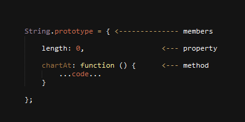
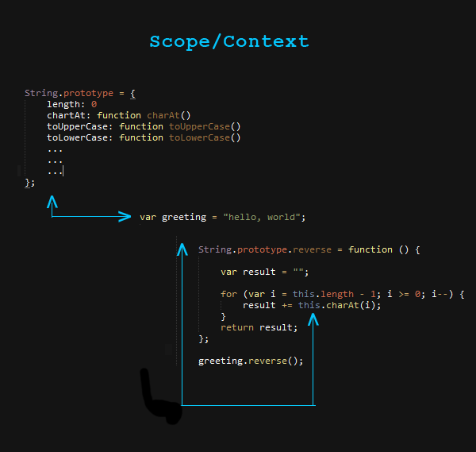

## Learning Goals

* define inheritance
* create a reverse and isEmpty method on String.prototype
* create a List object, which inherits from Array
* use the 'new' keyword to create object instances
* use scope to reference object members
* create a custom Creature object
* create a Supernatural creature, which inherits our Creature
* use instanceof to compare objects

## Intro

Today we're going to look at one of my favorite subjects: Inheritance in JavaScript. We'll be looking at the existing JavaScript objects String and Array, and how they make use of what's called a `prototype`. We'll be inheriting from the Array object to build our own List object, and finally, we'll be creating objects from scratch.

## What is Prototypical Inheritance ?

While that word combination sounds technical and scary, prototypical inheritance is just a fancy way of saying "inheritance." And what is inheritance? Inheritance is just a term to describe when one object is based on another.

Still kind of fuzzy? 

Let's look at inheritance in the real world first, then we'll apply it to JavaScript.

I inherited my early gray hair from my father. In that scenario, my father is the `base` object [or, the object that is passing on its properties] and I am the `derived` object [or, the object that is recieving/inheriting]. Characteristics, from him have been passed on to me, which is what happens in the programming world as well.

The reason it's called "Prototypical Inheritance" is because JavaScript is not a class-based language and uses something called a `prototype` to achieve the ability to inherit.

### Everything is an Object... Almost

Before we get our hands dirty I want to mention that in JavaScript, almost everything is an object. And all but one [primative] JavaScript objects have a prototype. This is really fantastic for us, because once we understand how objects work, we can apply it to  all areas of the language. Here's a list of a few commonly used objects in JavaScript:

1. String
2. Date
3. Array
4. Number
5. Function

So let's take a look at the prototype of these objects to get a feel for what's going on.

*Try it (I do, you follow along)*: Open up a Codepen and go to the JavaScript console. You'll also want to open up Developer Tools, preferably in Chrome as the console output is the easiest to read. View the below code in the console with the students. Have the students follow along on their machines so they can poke around.

```javascript
  console.info('String.prototype', String.prototype);
  console.info('Date.prototype', Date.prototype);
  console.info('Array.prototype', Array.prototype);
```

## A Look into String.prototype

Now that we've looked at a few different JavaScript objects and seen they all have a `prototype`, which consists of a variety of different `members`, let's shift our focus onto String and go a little deeper.

### Properties, Methods, Members

*Try it (we do)* Open back up the String.prototype in the console. Review the different `members`.

What are member? Members are a collection of `properties` and `methods`, which make up a `prototype`. `methods` are functions on a prototype and represent behavior. `properties` are everything else (strings, numbers, etc).



*Try it (I do, you follow along)*: Have students locate the toUpperCase method on the prototype. Once everybody has found it, walk through an example of using that method on a String instance:

```javascript
  var greeting = "hello, world";
  console.info(greeting.toUpperCase()); 
  // => "HELLO, WORLD"
```
What we can see here is that each time we create a new string, we have access to those members we saw earlier on the prototype. Knowing that, let's take this a step further and ADD to the prototype.

## String.prototype.reverse

As we just saw, there is a LOT on the prototype of String. However, one thing it doesn't have is the ability to reverse itself. So let's go ahead and add that. Then we'll have another look at the String prototype.

*Try it (I do, you follow along)*: Hop back into Codepen and write the following, together.

*Lesson Notes: There are a number of ways to write a reverse() method. For the sake of keeping studends level of understanding at a maximum, use a more fundamental way of achieving the result, such as a basic for-loop, rather than advanced alternatives.*

```javascript
String.prototype.reverse = function () {
  
	var result = "";
	
	for (var i = this.length - 1; i >= 0; i--) {
		result += this.charAt(i);
	}
	return result;
};

console.info(String.prototype.reverse);
```
Magic! We can see here our `reverse` method has been added to the String prototype. This is exactly what we want. So now let's use it the same way we used `toUpperCase` a few minutes ago.

*Try it (We do):*

```javascript
var greeting = "hello, world";
console.info(greeting.reverse());
// => "dlrow ,olleh"
```

### This is Context

Now, going back to our reverse method, you'll see i used a couple references to `this`. 

*Question*: Does anybody know what `this` is?

`this` is another JavaScript keyword which represents context. Entire lessons can be created around understanding JavaScript context, and I don't want us to cram too much complex information in too quickly, so for now I just want to briefly talk about it.

In the simplest of terms, context (or `this`) refers to the object the code is currently executing in. Let's take a quick look at our String object for example:



Our `reverse` method is on the String.prototype along with many other methods like `toLowerCase`, `charAt`, and `length`. When `reverse` is called, it's calls as a part of the String object. Since the String object also has these other members, we can access them easily by using the `this` keyword.

For now, that's all we really need to know. In future lessons we'll dive deeper into context.

--

#### Short Q&A/Checkin

*Questions*: The learning curve for prototype and object oriented JavaScript can be rather steep, now is a great time for questions in case anybody has fallen beind or is having a more difficult time understanding the material and what is taking place.

--

*Try it (You do)*: Now before we move on let's have a little individual fun with this. Each of you (students) create a member like we did with reverse, only this time let's call it `isEmpty`. I want the function to either return `false` if the string has characters, or return `true` if the string has no characters.

```javascript
String.prototype.isEmpty = function () {
  return this.length < 1;
};
```

Review one or two of the students solutions as a class.

## Inheriting from Array

Let's move on.

Now instead off adding to the `prototype` we are going to `inherit` from it. Let's move away from String and have a look at Array. Array is an awesome object, which already comes with a ton of cool memebers on the prototype. But what if we thought Array could benefit from having a few more things? Better yet, what if we want to create our OWN object and have it inherit all of Array's existing functionality? Let's going ahead and do that. 

### List

First we're going to create a List object, which inherits from Array. Then we are going to add the same `isEmpty` method we created on String but put it on List. Finally, we'll use it in a couple different scenarios and see how well it works for us.

*Try it (I do, you follow along)*:

```javascript
function List() {}

List.prototype = Object.create(Array.prototype);

console.info('Array.prototype', Array.prototype);
console.info('List.prototype', List.prototype);

```

Looking at the console, we can see that List.prototype contains all of the same members as Array. This is exactly what we want, so let's break down what we just did.

Whenever we create JavaScript objects that will make use of a prototype, we always want start by creating our object as a `function`. This function serves a very specific purpose, which we'll look at later. For now just know this is step one. 

Since a function is an object, and (almost) all objects in JavaScript have a prototype, it also has a prototype. And as we saw with objects earlier on, the prototype is what holds our members. So that is where we will do most of our work.

Since we first want to inherit from Array, we are assigning a copy of Array.prototype to List.prototype by using Object.create. Object.create is a really cool function that has some very advanced uses. I don't want to get into too much detail about it just yet. For now, just know that Object.create will create a prototype object from whatever you pass to it.

#### Adding isEmpty

Now that our List has inherited all off Array's memebers, let's add our isEmpty function we created earlier when we were using String.

*Try it (We do)*:

```javascript
function List() {}

List.protoype = Object.create(Array.prototype);

List.prototype.isEmpty = function () {
	return this.length < 1;
};

console.info('Array.prototype', Array.prototype);
console.info('List.prototype', List.prototype);

```

Looking at the two prototypes in the console, we can see that List has all of the same members as Array and now also has isEmpty, where as Array does not have isEmpty. We've successfully created a List object, inherited Array, and added a new isEmpty memeber to the prototype.

#### Array and List in Action

Let's take a little time to play around with our newly created object.

*Try it (I do, you follow)*:

```javascript
var colorList = new List(); 
var colorArray = new Array();

console.info('color list is empty', colorList.isEmpty());
console.info('color array is empty', colorArray.isEmpty());
```

What's this? A JavaScript error. Here we can see that Array does not have a property called isEmpty. But List does. So let's go ahead and remove that line and look at the output.

```javascript
var colorList = new List(); 

console.info('color list is empty', colorList.isEmpty());
```

There it is, `true`, since we haven't added anything to our list yet. Let's add a few strings to our list and check it again.

*Try it (We do):*

1. How can we add a few strings to our List ? (array methods we inherited)

```javascript
var colorList = new List(); 

colorList.push("red");
colorList.push("green");
colorList.push("blue");

console.info('color list is empty', colorList.isEmpty());
```
Now isEmpty give us back `false`, since we went ahead and added some strings to our List. 

*Optional, depending on students answer to question above*: But where did `push()` come from? Push is a member of Array and since our List inherits Array, we get everything it comes with as well.

## The 'new' Keyword

By now you've noticed us using the word 'new' when creating objects. 'new' is a reserved word in JavaScript. It's used to create what is called an `instance` of an object. An instance is a live/active occurance of an object. So, as mentioned earlier, if a prototype is the DNA or blueprint of an object, and instance is the creation and use of that blueprint in a single occurance.

This is also why when we added our `isEmpty` function to the String prototype earlier, ALL strings inherited it: Modify something on the prototype DNA and all instances receive the changes.

## Creature of the Night

Now that we've created our own List object, inherited an existing JavaScript object (Array), and created a new member on the prototype (isEmpty), we're going to create our very own object from scratch. After that, we'll use it as our `base` and create `derived` objects, which will inherit it. Sounds like a lot of work but it's actually going to be quite fun.

*Try it (We do)*: Together, as a class, we're going to build an object from scratch. The object is going to be called `CreatureOfTheNight`. We're going to brainstorm together, different charateristics a `CreatureOfTheNight` might have and then we'll add them to our prototype.

*Questions*

1. To build our CreatureOfTheNight object, what do we start with? (function)
2. What are some characteristics a CreatureOfTheNight might have? (hair, eyes, height, weight, sounds, etc)
3. What are some actions or behaviors a CreatureOfTheNight might perform?

```javascript
function CreatureOfTheNight() {}

CreatureOfTheNight.prototype = {
	name: 'Creature',
	sound: 'Growllll',
	hairColor: '',
	eyeColor: '',
	numberOfEyes: 2,
	height: 0,
	weight: 0,
	
	speak: function () {
		alert(this.sound);
	}
};

```

So there's our CreatureOfTheNight object. Let's create an `instance` of it and call the method `speak`.

*Try it (We do)*:

```javascript
var creature = new CreatureOfTheNight();
creature.speak();
```

Not perticularly special just yet but that's okay. There's more.

### Vampires

How many different supernatural creatures and monsters can you think of? Probably a lot. For me, the first ones that come to mind are Vampires, Zombies, and Werewolves. Those are all creatures of the night and because of that, they all share similar characteristics to a creature of the night. Sounds like a good opportunity to use inheritance. 

*Try it (We do)*: Let's make a Vampire object.

*Questions*

1. To build our vampire object, what do we start with ? (function)
2. To inherit CreatureOfTheNight, what do we do? (Object.create)
3. How do we change the sound of our vampire object?
4. How do we create an instance and call speak?

```javascript
function Vampire () {}

Vampire.prototype = Object.create(CreatureOfTheNight.prototype);
Vampire.prototype.name = "Vampire";
Vampire.prototype.sound = "I want to drink your blood!!!";

var vampire = new Vampire();
vampire.speak();

```
#### Constructors

At this point we've created quite a few objects. Remember how the first step in creating our objects is to create a function? The reason for that is because the function is what's called an object's `constructor`. A `constructor` is a function that is run each time a new `instance` is created. So each time we say 'new' the `constructor` is run and an instance of our DNA, or `prototype`, is produced. This is very handy and allows us to configure an object each time it's created.

*Try it (I do, you follow along)*: Let's update our Vampire object to use the constructor. We're going to allow the ability to pass in the `name` and `eyeColor` of each vampire that gets created. We're also going to create a new `speak` method, which will use the vampire names.

```javascript
function Vampire(name, eyeColor) {
	this.name = name;
	this.eyeColor = eyeColor;
}

Vampire.prototype = Object.create(CreatureOfTheNight.prototype);
Vampire.prototype.sound = "I want to drink your blood!!!";
Vampire.prototype.speak = function () {
	alert("My name is " + this.name + " and " + this.sound); 
};
```

*Try it (We do)*: Now we're able to pass in a value for `name` and `eyeColor` and apply it to the Vampire instance each time a new one is created. Let's take a look:

```javascript
var bobby = new Vampire("Bobby", "blue");
var susie = new Vampire("Susie", "green");

bobby.speak();
susie.speak();

```

### Assignment - Make Your Own Creature

*Try it (You do):*

Break into pairs/groups (depending on class size).

Create your own CreatureOfTheNight. Your creature should meet the below criteria:

1. Inherits CreateOfTheNight object.
2. Makes use of the constructor function
3. Updates the speak function to do something different than CreatureOfTheNight
4. Add 1 or more creative, additinal features to your creature

*Share*

At this point, we'll share group/pair creatures with the rest of the class, pass around ideas, suggestuions, what works, what doesn't, etc.

## Recap

## Q & A

Any time left over use for Q&A. Inheritance and prototype are large subjects and we've just touched the surface. There are bound to be questions from students after this session.

Student questions you may run into durring the lesson/QA.

Q. Why don't I have to use 'new' for string, number, array (ie: "string", 10, [])

A. String, number, array, and Object are primitave types which means they don't require the 'new' keyword in order to use. Any objects which we create ourselves must use the 'new' keyword, and most other JavaScript objects also use the 'new' keyword. Take Date for example.

Q. How is it I can use toUpperCase() on a string and don't have to reference the word `prototype` (ie: "string".toUpperCase() vs. "string".prototype.toUpperCase()).

A. When you create a string, or any other object, you are creating an instance (if you are in the lesson and have not gotten to instances yet, touch briefly on that content). The prototype of an object is just a blueprint or DNA of that object and is not actually put to use until a new instance is created. When a new instance is created, you are creating a copy of the blueprint, therefore the 'prototype' is actually what you're using.

Q. Difficulty around context
A. Show diagram of scope/context and visually step through the proccess of what is happening. Context can be hard to explain with words only.
